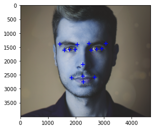
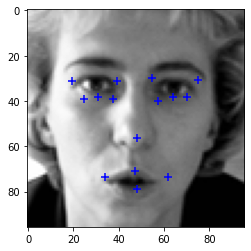

# Real time 15-Landmarks detection
The objective is to train a deep neural network to detect and predict 15 facial landmarks from a video frame, which includes five points around each eye,  one at the nose, and four around the mouth. It can be used in many applications as face tracking where the face is detected and 15 points are predicted on it.

                                                                                 

The CNN takes any images as an input, pre-process them (converting to grayscale and 96x96) and predicts 30 coordinates which are the x and y for the 15 landmarks. The training is performed on dataset from kaggle. This dataset consists of 7000 images. All of these images are separated into either a training or a validation set of data.

The project consists of 3 python files:

model.py : including the convolutional neural network atchitecture
preprocessing_modelTraining.py : includes the preprocessing of the input data and training stage for the CNN model.
real-time-detection.py : which opens a video streaming, detecting the face in each frame and predicting its 15 landmark.

# Summary for the CNN architecture

# Results

